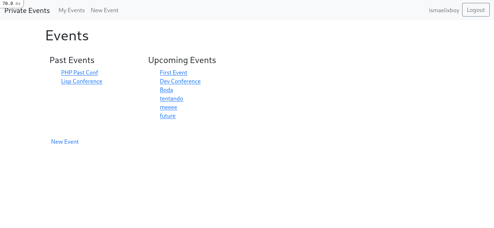

# Private Events

This project is a Private Events app. The idea is to create an app where the members of the website can publish events, attend events and invite other users.

## App Home Page

## Getting Started :

- Clone the repository: `git clone https://github.com/ixboy/private-events.git`
- Move inside the folder: `cd private-events`
- Make sure you have Ruby `2.7.2`
- Run: `bundle install`
- Run: `rails db:seed`
- Run: `rails db:create` and `rails db:migrate`.
- Run the server: `rails s` or `rails server`
- To see the app on your local machine open your browser and type: `http://localhost:3000`. Have fun !!!

## BUILT WITH

-HTML
-CSS
-bootstrap
-Ruby
-Ruby on Rails

## AUTHORS

👤 **Iyunda Ismael Antonio**

- GitHub: [@ixboy](https://github.com/ixboy)
- Twitter: [@ismaelixboy](https://twitter.com/ismaelixboy)
- LinkedIn: [ismael-antonio](https://www.linkedin.com/in/ismaelantonio/)

## 🤝 Contributing

Contributions, issues, and feature requests are welcome!

## Show your support

Give a ⭐️ if you like this project!

## 📝 License

This project is [MIT](./LICENSE) licensed.